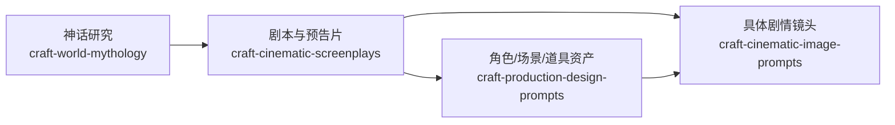

# Cinematic AI Skills

一组面向 Codex 的中文影视创作 skills，覆盖世界神话研究、电影编剧、影视概念资产和电影级 AI 图像提示词。四个 skill 可以独立安装，也可以组成从研究到镜头的完整创作链。

> A modular Codex skill suite for mythology research, screenwriting, production design, and process-driven cinematic image prompts. The skills are written in Chinese and can be installed independently or used as an end-to-end pipeline.

## Skills

| Skill | 单独使用时解决什么 | 可交接给 |
|---|---|---|
| [`craft-world-mythology`](skills/craft-world-mythology/) | 检索 14 个神话体系中的实体、关系、武器和术法；区分数据集、原典、学术解释、流行版本与项目改编；建立跨谱系改编边界 | 编剧、资产设计 |
| [`craft-cinematic-screenplays`](skills/craft-cinematic-screenplays/) | 开发或重构电影、剧集、短片、预告片；处理命题、人物欲望、因果压力、场景转折、潜台词和不可逆后果 | 资产设计、电影镜头 |
| [`craft-production-design-prompts`](skills/craft-production-design-prompts/) | 设计角色、场景和物品；生成 Hero Concept、Production Lock、三视图、配饰登记、情绪版和资产 DNA | 电影镜头 |
| [`craft-cinematic-image-prompts`](skills/craft-cinematic-image-prompts/) | 从摄影发生过程构建超写实电影镜头提示词；处理人物表演、机位、布光、工业级 VFX、真实皮肤、色彩和连续性 | 图像/视频生成工作流 |

## 组合工作流



这不是强制流水线：

- 只查神话资料，单独使用 `craft-world-mythology`。
- 已有剧本，只使用 `craft-cinematic-screenplays` 做诊断或重构。
- 只做角色三视图、场景或道具，单独使用 `craft-production-design-prompts`。
- 已有完整设定，只使用 `craft-cinematic-image-prompts` 生成电影镜头提示词。

完整项目建议按以下交接：

1. 神话 skill 输出文化母体、具体版本、证据层级和改编边界。
2. 编剧 skill 将研究转成人物欲望、关系压力、场景因果和不可逆后果。
3. 资产 skill 锁定角色、场景、道具、材质、配饰与跨图 DNA。
4. 镜头 skill 保留剧本节拍和资产 DNA，设计摄影机位置、布光、表演、动作、VFX 与连续性。

## 安装

克隆仓库后安装全部 skills：

```bash
git clone https://github.com/yuetongyu/cinematic-ai-skills.git
cd cinematic-ai-skills
python3 scripts/install_skills.py --all
```

只安装指定 skill：

```bash
python3 scripts/install_skills.py --skill craft-cinematic-screenplays
python3 scripts/install_skills.py \
  --skill craft-production-design-prompts \
  --skill craft-cinematic-image-prompts
```

安装脚本默认使用 `${CODEX_HOME}/skills`，未设置 `CODEX_HOME` 时使用 `~/.codex/skills`。已有同名 skill 时默认拒绝覆盖；确认更新时加 `--force`，旧目录会先被备份。

也可以手动把任意 `skills/<skill-name>` 目录复制到 Codex skills 目录。安装或更新后，重新打开相关 Codex 任务以刷新 skill 列表。

## 使用示例

```text
使用 $craft-world-mythology，比较中国上古神话与两河神话中“洪水”的秩序意义，标明版本差异和可改编边界。
```

```text
使用 $craft-cinematic-screenplays，把这个世界观开发成 90 秒预告片。不要念设定，用人物选择和不可逆后果建立钩子。
```

```text
使用 $craft-production-design-prompts，为主角生成 Hero Concept，再输出左侧 1/3 面部特写、右侧 2/3 Front/Profile/Back 的生产设定板。
```

```text
使用 $craft-cinematic-image-prompts，把这一场写成真实电影剧照提示词。说明摄影机为何在这里，并锁定布光、皮肤、动作、粒子流向和跨镜色彩连续性。
```

组合调用示例：

```text
先用 $craft-world-mythology 核验方相氏的原型与版本，再用 $craft-cinematic-screenplays 建立人物选择；用 $craft-production-design-prompts 锁定角色和仪式资产，最后用 $craft-cinematic-image-prompts 输出三个连续电影镜头。每一步明确传统事实与项目改编。
```

## 内置神话数据

`craft-world-mythology` 内置 `references/world-mythology-dataset.md`：

- 14 个神话体系
- 597 个实体
- 920 条关系事件
- 701 件武器/法宝
- 68 套术法体系

数据集是研究入口，不是唯一正典。涉及精确引文、年代、争议版本、活态宗教或文化敏感内容时，skill 会要求继续使用原典、博物馆、大学、学术出版物或传统内部权威来源核验。

查询与验证：

```bash
python3 skills/craft-world-mythology/scripts/query_mythology.py entity "后羿"
python3 skills/craft-world-mythology/scripts/query_mythology.py search "洪水" --system "两河流域神话"
python3 skills/craft-world-mythology/scripts/query_mythology.py validate --json
```

## 设计原则

- 描述摄影和表演发生的过程，不用 `cinematic`、`8K` 或导演名字代替决策。
- 先保护英雄概念的想象力，再进入生产锁定，避免把第一张图写成规格登记表。
- 真实人物不等于显老、磨皮或美容脸；主角感来自目标、表演和视觉层级。
- 特效必须具备发射源、流向、碰撞、光照、沉积与耗散，并维持镜头连续性。
- 神话改编必须区分原典、解释、后世版本和原创，不把全球传统混成元素拼盘。

## 仓库结构

```text
cinematic-ai-skills/
├── skills/
│   ├── craft-world-mythology/
│   ├── craft-cinematic-screenplays/
│   ├── craft-production-design-prompts/
│   └── craft-cinematic-image-prompts/
├── scripts/install_skills.py
├── CONTRIBUTING.md
├── DATA_LICENSE.md
└── LICENSE
```

## License

- Skill instructions, references, and scripts: [MIT License](LICENSE).
- Bundled mythology dataset: [Creative Commons Attribution 4.0 International](DATA_LICENSE.md).
- Ancient source texts and third-party materials retain their respective public-domain or third-party status; dataset source labels are research pointers, not a transfer of third-party rights.

## English Summary

Each directory under `skills/` is a standalone Codex skill. Install one or all of them with the bundled installer. The suite separates research truth, dramatic adaptation, reusable production assets, and final cinematography so downstream work cannot silently rewrite upstream evidence or identity constraints. See each `SKILL.md` for the complete workflow.
