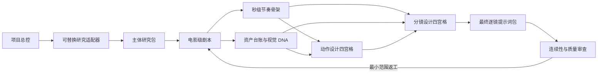

# Cinematic AI Skills

一套面向 Codex 的模块化 AI 影视制片 skills。现在不只是“神话研究 → 编剧 → 生图提示词”的松散链路，而是一条可从任意阶段进入、可局部返工、可检查依赖和连续性的 AI 漫剧制片 DAG。

> A modular Codex production suite for research, screenwriting, asset design, action direction, storyboards, and process-driven cinematic image/video prompts.

## 这次解决了什么

- 一个入口即可把“根据夜叉做 90 秒 AI 漫剧”路由到七个专业 skill。
- 每个 skill 仍可单独安装和调用，不被总控绑定。
- 研究层可替换：当前内置神话研究，未来历史、游戏背景和小说世界研究只需输出同一 `RESEARCH_PACKET`。
- 剧本后先建立秒级节奏骨架；资产、动作和分镜锁定后才生成最终逐镜提示词。
- 角色、场景、物品、非人实体和 VFX 使用稳定 ID 与状态版本。
- 动作四宫格与分镜四宫格是不同产物，并且都同时提供四张独立生成提示词。
- 下游通过 `depends_on` 引用上游 revision，不允许静默修改事实、剧情结果和资产 DNA。

这里的“区块化”指制片溯源，不使用真实区块链。

## Skills

| Skill | 专业职责 | 主要交付 |
|---|---|---|
| [`orchestrate-ai-drama-production`](skills/orchestrate-ai-drama-production/) | 总控制片、路由、阶段门、返工与连续性 | Project Manifest、生产 DAG |
| [`craft-world-mythology`](skills/craft-world-mythology/) | 神话检索、版本核验、主体提炼和改编边界 | `RESEARCH_PACKET` |
| [`craft-cinematic-screenplays`](skills/craft-cinematic-screenplays/) | 命题、人物、因果、场景、对白与 AI 漫剧剧本 | `SCRIPT_PACKET`、`TIMING_MAP` |
| [`craft-production-design-prompts`](skills/craft-production-design-prompts/) | 角色、非人实体、场景、物品、VFX 源和资产 DNA | `ASSET_REGISTRY` |
| [`craft-cinematic-action-design`](skills/craft-cinematic-action-design/) | 战斗、追逐、仪式、施法、关系动作和受力连续性 | `ACTION_PACKET`、动作四宫格 |
| [`craft-cinematic-storyboards`](skills/craft-cinematic-storyboards/) | 观众路径、轴线、机位、景别、剪辑和声音桥 | `STORYBOARD_PACKET`、分镜四宫格 |
| [`craft-cinematic-image-prompts`](skills/craft-cinematic-image-prompts/) | 最终摄影、布光、表演、VFX、色彩和平台提示词 | `SHOT_PACKET` |

## 完整制片链



专业顺序不是简单的 1→6。剧本完成后先建立时间骨架；资产概念和动作预研可以有限并行；复杂动作要在最终分镜前锁定；最终摄影提示词必须接收已确认的资产、动作和分镜。

## 一句话直接使用

```text
使用 $orchestrate-ai-drama-production，根据夜叉开发一集 90 秒、9:16 的 cinematic-ai-comic AI 漫剧。先用神话研究区分版本并保护主体性，再完成剧本、秒级时间图、全剧资产台账、动作四宫格、分镜四宫格和最终逐镜提示词；所有原创内容标为项目改编。
```

总控会按阶段输出；长项目建议把 Packet 写入项目目录，避免一次回复塞入整季内容。

## 单独调用

```text
使用 $craft-world-mythology，研究夜叉的不同传统与版本，输出 RESEARCH_PACKET，不写完整剧本。
```

```text
使用 $craft-cinematic-screenplays，把这份研究包改编成 90 秒 AI 漫剧，输出 SCRIPT_PACKET 和 TIMING_MAP。
```

```text
使用 $craft-production-design-prompts，从完整剧本提取 CHR、ENT、ENV、PRP、VFX 资产台账，只对 A 级资产做 Hero Concept 和 Production Lock。
```

```text
使用 $craft-cinematic-action-design，把 B003 设计成四个有因果的动作相位，同时输出四张独立提示词和 2×2 审阅板提示词。
```

```text
使用 $craft-cinematic-storyboards，根据剧本、资产和动作包生成四个连续镜头，锁定轴线、出入画、剪辑与声音桥。
```

```text
使用 $craft-cinematic-image-prompts，根据 STORYBOARD_PACKET 合成 SH001-SH004 的首帧、关键帧、尾帧和视频运动提示词，使用 cinematic-ai-comic profile。
```

## 两种四宫格

| 类型 | 每格是什么 | 解决什么 |
|---|---|---|
| 动作四宫格 | 同一动作的意图/预备、发动、接触、后果 | 重心、轨迹、接触、受力和 VFX 相位 |
| 分镜四宫格 | 四个连续电影镜头 | 观众位置、轴线、景别、剪辑和信息顺序 |

四宫格是审阅联系表，不替代高质量单帧。两个 skill 默认同时输出四张独立提示词；镜号、箭头和时间码建议后期排版。

## 统一生产契约

每个 Packet 包含：

```text
schema_version / packet_type
project_id / episode_id
block_id / revision / status
source_revision / depends_on
locked_fields / controlled_fields / open_fields
assumptions
continuity_in / continuity_out
change_log
payload
```

稳定 ID：

```text
RSH 研究    SCR 剧本    SC 场景    B 节拍    T 时间
CHR 角色    ENT 实体    ENV 环境    PRP 物品   VFX 视效
ACT 动作    SEQ 序列    SH 镜头
```

详细规范见 [Production Packet Contracts](skills/orchestrate-ai-drama-production/references/production-packet-contracts.md)。

## 项目脚手架

新建项目：

```bash
python3 skills/orchestrate-ai-drama-production/scripts/init_project.py \
  "Yaksha 90s" \
  --output ./productions \
  --project-id YAKSHA-001 \
  --duration 90 \
  --aspect-ratio 9:16 \
  --research-domain mythology \
  --visual-profile cinematic-ai-comic
```

验证依赖、ID、revision、字段锁定和时间段：

```bash
python3 skills/orchestrate-ai-drama-production/scripts/validate_project.py \
  ./productions/yaksha-90s \
  --json
```

仓库内置一个最小但完整的 [夜叉 90 秒工作流夹具](examples/yaksha-90s-demo/)。它用于验证生产链，不是固定剧情或权威神话结论；示例研究包明确保留了原典核验要求。

## 视觉 Profile

- `live-action-photoreal`：真实演员、健康软组织、区域皮肤、低修图和工业级真人摄影。
- `cinematic-ai-comic`：AI 漫剧/电影动画式角色比例、线条/边缘、色块、渲染密度和夸张范围；仍使用电影级空间、表演、光色和物理连续性，不强加真人毛孔。
- `custom`：由项目明确锁定的其他视觉系统。

## 安装

```bash
git clone https://github.com/yuetongyu/cinematic-ai-skills.git
cd cinematic-ai-skills
python3 scripts/install_skills.py --all
```

只安装指定 skill：

```bash
python3 scripts/install_skills.py \
  --skill orchestrate-ai-drama-production \
  --skill craft-cinematic-action-design \
  --skill craft-cinematic-storyboards
```

安装目标默认为 `${CODEX_HOME}/skills`，未设置时使用 `~/.codex/skills`。已有同名 skill 时加 `--force`，安装器会先备份旧版本。

## 内置神话数据

`craft-world-mythology` 内置定向查询数据：

- 14 个神话体系
- 597 个实体
- 920 条关系事件
- 701 件武器/法宝
- 68 套术法体系

```bash
python3 skills/craft-world-mythology/scripts/query_mythology.py entity "后羿"
python3 skills/craft-world-mythology/scripts/query_mythology.py search "夜叉" --json
python3 skills/craft-world-mythology/scripts/query_mythology.py validate --json
```

数据集是研究入口，不是唯一正典。具体引文、年代、争议版本和活态宗教内容必须继续使用原典、博物馆、大学、学术出版物或传统内部权威来源核验。

## 验证

```bash
python3 scripts/validate_repo.py
python3 skills/orchestrate-ai-drama-production/scripts/validate_project.py \
  examples/yaksha-90s-demo --json
```

## 仓库结构

```text
cinematic-ai-skills/
├── skills/
│   ├── orchestrate-ai-drama-production/
│   ├── craft-world-mythology/
│   ├── craft-cinematic-screenplays/
│   ├── craft-production-design-prompts/
│   ├── craft-cinematic-action-design/
│   ├── craft-cinematic-storyboards/
│   └── craft-cinematic-image-prompts/
├── examples/yaksha-90s-demo/
├── scripts/install_skills.py
├── scripts/validate_repo.py
├── CONTRIBUTING.md
├── DATA_LICENSE.md
└── LICENSE
```

## License

- Skill instructions, references, examples, and scripts: [MIT License](LICENSE).
- Bundled mythology dataset: [Creative Commons Attribution 4.0 International](DATA_LICENSE.md).
- Ancient source texts and third-party materials retain their respective public-domain or third-party status.

## English Summary

The suite now separates research truth, dramatic adaptation, timing, reusable assets, physical action, editorial storyboards, and final camera prompts. A production packet never behaves like creative DRM: it exists to make dependencies and continuity visible while keeping each skill independently usable.
